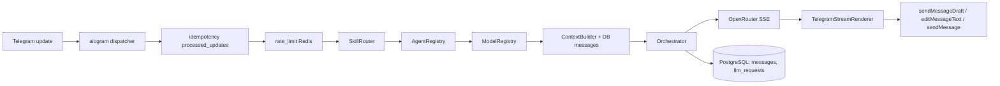

# Telegram AI Core

Production-oriented ядро Telegram-бота с поддержкой нескольких **агентов**, **навыков** (skills) и LLM-моделей через OpenRouter. Стек — `Python 3.12`, `FastAPI`, `aiogram 3`, `SQLAlchemy 2 (async)`, `PostgreSQL 16`, `Redis 7`, `httpx`, `Alembic`. Никаких LangChain / CrewAI / AutoGen.

## Что это

- aiogram-бот с long-polling (webhook заложен, но MVP проверяется на polling).
- FastAPI для health-check-ов и опционального webhook-роутера.
- Streaming-ответы через OpenRouter (SSE) и инкрементальная отрисовка в Telegram через `sendMessageDraft` + `editMessageText`.
- Маршрутизация запроса: в обычном режиме команда → активный skill из conversation → keyword-matching → дефолт; в режиме спецагента — фиксированный agent/skill/model без keyword auto-routing.
- `/ask` одноразово вызывает агента без смены активного режима.
- Access control через `BOT_ACCESS_MODE`, allowlist/admin ids и admin-only `/debug`.
- Persistent storage: пользователи, чаты, conversation-ы, сообщения, журнал LLM-запросов, идемпотентность апдейтов.
- Rate limit, usage counters и идемпотентность через Redis с graceful-degradation в случае его недоступности.

## Архитектура



Слои:

- `app/api/` — HTTP-роутеры FastAPI (`/health`, `/ready`, `/telegram/webhook`).
- `app/bot/` — aiogram-инфраструктура: bot factory, dispatcher, polling, handlers, renderers.
- `app/agents/`, `app/skills/`, `app/models/` — in-memory профили (registry).
- `app/core/` — `context_builder`, `orchestrator`, `rate_limit`, `idempotency`, `prompts`.
- `app/llm/` — клиент OpenRouter (httpx + ручной SSE).
- `app/db/` — SQLAlchemy ORM + репозитории.
- `app/redis/` — async Redis client.
- `app/utils/` — текстовые утилиты, в т.ч. сплиттер для Telegram (3900 символов).

## Локальный запуск

Требования: `docker`, `docker compose`.

```bash
cd telegram-ai-core
cp .env.example .env
# при желании заполни TELEGRAM_BOT_TOKEN и OPENROUTER_API_KEY
docker compose up -d --build
docker compose ps
curl http://localhost:8000/health
curl http://localhost:8000/ready
```

Без `TELEGRAM_BOT_TOKEN` бот не стартует, FastAPI работает.
Без `OPENROUTER_API_KEY` бот ответит «OpenRouter API key не настроен. Добавь OPENROUTER_API_KEY в переменные окружения.».

Тесты в контейнере:

```bash
docker compose exec -T app pytest -q
```

Локальная установка зависимостей вне Docker (опционально):

```bash
python3.12 -m venv .venv && source .venv/bin/activate
pip install -e ".[dev]"
pytest -q
```

## Деплой на Railway

1. Положи репозиторий на GitHub.
2. На Railway: **New Project → Deploy from GitHub repo → выбери этот репо**.
3. Добавь к проекту managed-сервисы **PostgreSQL** и **Redis** (плагины Railway).
4. В сервисе приложения открой **Variables** и добавь:
   - `APP_ENV=railway`
   - `TELEGRAM_MODE=polling`
   - `TELEGRAM_BOT_TOKEN=<твой токен>`
   - `OPENROUTER_API_KEY=<твой ключ>`
   - `OPENROUTER_MODEL=openai/gpt-4.1-mini`
   - `OPENROUTER_SITE_URL=https://your-domain.example`
   - `OPENROUTER_APP_NAME=Telegram AI Core`
   - `DATABASE_URL=${{Postgres.DATABASE_URL}}`
   - `REDIS_URL=${{Redis.REDIS_URL}}`
   - `ADMIN_TELEGRAM_IDS=<твой Telegram user id>` (если нужны `/settings` и `/debug`)
   - `BOT_ACCESS_MODE=public` (или `allowlist` / `admin_only`)
5. Railway автоматически подставит реальные URL баз через reference-переменные.
6. `railway.toml` уже содержит правильный `startCommand` (`bash scripts/entrypoint.railway.sh`) и `healthcheckPath=/health`. После первого деплоя миграции применятся автоматически.

После изменения переменных — нажми **Redeploy** в dashboard, либо `Restart` сервиса.

### Привязка к Postgres/Redis на Railway: 1 команда

Если не хочется править Variables вручную — выполни локально:

```bash
bash scripts/railway-bind.sh
```

Скрипт через Railway CLI определит имена сервисов Postgres и Redis в текущем
проекте и проставит в app-сервис reference-переменные:

```
DATABASE_URL=${{<Postgres-service>.DATABASE_URL}}
REDIS_URL=${{<Redis-service>.REDIS_URL}}
```

После этого нажми **Redeploy**. Подробности — в `VARIABLES.md`.

Резолвер `app/config.py` толерантен к формату переменных: достаточно любого из
`DATABASE_URL` / `POSTGRES_URL` / `DATABASE_PRIVATE_URL` / `DATABASE_PUBLIC_URL`
или набора `PGHOST`+`PGPORT`+`PGUSER`+`PGPASSWORD`+`PGDATABASE` для PostgreSQL.
Аналогично для Redis: `REDIS_URL` / `REDIS_PRIVATE_URL` / `REDIS_PUBLIC_URL`
или `REDISHOST`+`REDISPORT`+`REDISUSER`+`REDISPASSWORD`.

### Диагностика в проде: `GET /diagnostics`

После деплоя проверь:

```bash
curl https://<your-app>.up.railway.app/diagnostics
```

Эндпоинт отдаёт JSON со статусом `postgres`/`redis`, версиями серверов,
текущим `schema_version` (Alembic head) и `connection_sources` — без секретов
и без raw-URL. Опционально можно защитить эндпоинт переменной
`DIAGNOSTICS_TOKEN`: тогда нужно передавать `X-Diagnostics-Token: <token>`.

## Режимы агентов

По умолчанию бот работает в обычном режиме: отвечает универсальный агент
`general` через навык `chat`, а обычные сообщения маршрутизируются текущим
`SkillRouter`-ом.

Команда `/agent` отвечает за использование специализированного агента. Без
аргументов она открывает inline-меню доступных спецрежимов; универсальный
`general` в этом меню не показывается, потому что это обычный режим по
умолчанию. Доступные спецрежимы:

- `/agent crypto` — включает режим «Криптовалютный аналитик»:
  `active_mode=agent`, `active_agent_id=crypto`, `active_skill_id=crypto`,
  `active_model_id=crypto_model`.
- `/agent news` — включает режим «Новостной агент»:
  `active_mode=agent`, `active_agent_id=news`, `active_skill_id=news`,
  `active_model_id=news_model`.

Пока включён спецрежим, все обычные текстовые сообщения обрабатываются
выбранным агентом. Keyword auto-routing поверх активного режима агента не
запускается: например, сообщение про `bitcoin` в режиме `news` останется в
`news`, пока пользователь не выйдет из режима.

Команда `/exit` выходит из специализированного режима и возвращает обычный
режим:

```text
active_mode=default
active_agent_id=general
active_skill_id=chat
active_model_id=default_balanced
```

`/settings` отвечает за настройку prompt/model агентов, а `/agent` — за выбор
того, какой агент сейчас обрабатывает сообщения.

Команда `/ask` делает одноразовый вызов агента и не меняет текущий режим:

```text
/ask crypto Что думаешь про ETH?
/ask news Что произошло с Telegram?
```

Если активен режим `news`, команда `/ask crypto ...` обработает только этот
вопрос через `crypto`, а следующие обычные сообщения снова пойдут в `news`.

Команда `/new` создаёт новый диалог: старая ACTIVE conversation архивируется,
создаётся новая ACTIVE с выбранным режимом.

```text
/new
/new default
/new crypto
/new news
```

`/reset` создаёт новый диалог с тем же режимом, `/reset all` возвращает
`default/general`.

Примеры:

```text
/agent
/agent crypto
/agent news
/exit
/ask crypto Что думаешь про ETH?
/ask news Что произошло с Telegram?
/new
/reset all
/status
```

### Разница между `/agent`, `/ask` и `/settings`

- `/agent` — войти в специализированный режим агента для всех следующих сообщений.
- `/ask` — одноразово спросить конкретного агента без смены режима.
- `/settings` — настроить API, prompt и модель агента.

### Agent-scoped history

Новые сообщения сохраняют фактические `agent_id`, `skill_id` и `model_id`.
Контекст LLM строится по текущему resolved agent: `crypto` не получает историю
`news`, а старые сообщения без `agent_id` временно учитываются только для
`general`.

## Навыки, агенты, модели

### Skills

| id | команды | агент | модель |
|---|---|---|---|
| `chat` | `/chat` | `general` | `default_balanced` |
| `ask` | `/ask` | `general` | `default_balanced` |
| `fast` | `/fast` | `general` | `default_fast` |
| `crypto` | `/crypto` | `crypto` | `crypto_model` |
| `defi` | `/defi` | `crypto` | `crypto_model` |
| `token` | `/token` | `crypto` | `crypto_model` |
| `finance` | `/finance` | `finance` | `finance_model` |
| `news` | `/news` | `news` | `news_model` |
| `summarize_news` | `/summarize_news` | `news` | `news_model` |
| `devops` | `/devops`, `/infra` | `devops` | `devops_model` |

### Агенты

| id | имя | safety | дефолтная модель |
|---|---|---|---|
| `general` | Универсальный ассистент | normal | `default_balanced` |
| `crypto` | Криптовалютный аналитик | financial_cautious | `crypto_model` |
| `finance` | Финансовый аналитик | high | `finance_model` |
| `news` | Новостной агент | high_caution | `news_model` |
| `devops` | DevOps инженер | standard | `devops_model` |

### Модели

| id | provider/model | tier | streaming |
|---|---|---|---|
| `default_fast` | openrouter / `google/gemini-2.0-flash-001` | cheap | да |
| `default_balanced` | openrouter / `openai/gpt-4.1-mini` | balanced | да |
| `crypto_model` | openrouter / `openai/gpt-4.1-mini` | balanced | да |
| `finance_model` | openrouter / `openai/gpt-4.1-mini` | balanced | да |
| `news_model` | openrouter / `google/gemini-2.0-flash-001` | cheap | да |
| `devops_model` | openrouter / `openai/gpt-4.1-mini` | balanced | да |

## Streaming в Telegram

- OpenRouter вызывается через `POST /chat/completions` с `stream=true`.
  Клиент читает SSE/event-stream, извлекает `choices[].delta.content`,
  игнорирует пустые служебные chunks и завершает чтение на `[DONE]`.
- В private-чате renderer сначала пытается обновлять `sendMessageDraft`
  с числовым `draft_id`. Если текущая версия aiogram не умеет этот метод,
  используется низкоуровневый HTTPS-вызов Bot API без логирования токена.
- Draft/update throttling настраивается через:
  - `TELEGRAM_DRAFT_UPDATE_INTERVAL_MS=500`
  - `TELEGRAM_STREAM_MIN_CHARS_DELTA=24`
  - `TELEGRAM_STREAM_DRAFT_ENABLED=true`
  - `TELEGRAM_STREAM_EDIT_FALLBACK_ENABLED=true`
- Если draft недоступен или падает, включается fallback:
  сначала обычный `sendMessage` с «Генерирую ответ...», затем
  `editMessageText` с тем же throttle. Ошибка `message is not modified`
  игнорируется.
- В group/supergroup draft не используется: только edit fallback и финальный
  `sendMessage`.
- Финальный ответ всегда отправляется через `sendMessage`. Текст длиннее
  лимита режется на части по 3900 символов через `app/utils/text_splitter.py`.
- Пустой ответ модели → пользователь получает «Не удалось получить ответ от модели.»
- В лог пишутся безопасные события `streaming_started`,
  `streaming_chunk_received`, `draft_update_sent`,
  `draft_update_failed_fallback_enabled`, `edit_fallback_update_sent`,
  `final_message_sent`, `llm_request_success/error` без токенов, ключей,
  полного prompt или длинного пользовательского текста.

## Notification outbox (Stage 5)

ETH price alerts и ежедневный digest **не шлют Telegram напрямую** из detection-воркеров. При срабатывании или готовности digest создаётся запись в таблице `notification_outbox`; отдельный **notification delivery worker** читает очередь (`FOR UPDATE SKIP LOCKED`), вызывает `send_message`, при ошибках делает **exponential backoff** до `max_retries`, после чего помечает запись как окончательно проваленную.

- `NOTIFICATION_WORKER_INTERVAL_SECONDS` — пауза между циклами доставки (по умолчанию 10).
- `NOTIFICATION_WORKER_BATCH_SIZE` — сколько записей забирать за итерацию (по умолчанию 20).

Фоновые воркеры (цена ETH с CoinGecko):

- `ETH_ALERT_WORKER_INTERVAL_SECONDS` — опрос активных алертов.
- `DAILY_DIGEST_WORKER_INTERVAL_SECONDS` — проверка пользователей с включённым digest.

Digest: `last_digest_sent_at` обновляется **только после успешной доставки** `daily_digest` в Telegram, чтобы не терять день при сбое отправки. Дубликаты digest на один UTC-день на пользователя не создаются (проверка по `payload_json.digest_date` и статусам pending/processing/sent).

Команда **`/notifications`** показывает последние 10 уведомлений пользователя (тип, статус, retries, время); полный текст и payload в чат не выводятся.

**Ограничения MVP:** один индикатор (ETH USD) в digest; нет портфельной аналитики; при падении CoinGecko уведомления просто откладываются до следующего тика воркера.

## Команды бота

- `/start`, `/help` — приветствие и справка.
- `/new`, `/new default`, `/new crypto`, `/new news` — создать новый диалог.
- `/reset` — создать новый диалог с текущим режимом.
- `/reset all` — создать новый диалог и вернуть обычный `general`.
- `/status` — app/Telegram status, режим conversation, agent / skill / model, provider/model, PostgreSQL/Redis.
- `/debug` — безопасная техническая диагностика только для admin ids.
- `/history` — последние 20 сообщений диалога.
- `/agents` — список всех включённых агентов.
- `/agent`, `/agent crypto`, `/agent news` — меню и включение специализированного режима агента.
- `/exit` — выход из специализированного режима в обычный `general`.
- `/ask crypto <текст>`, `/ask news <текст>` — одноразовый вопрос агенту без смены режима.
- `/skills`, `/skill <id>` — список и переключение skill.
- `/models`, `/model <id>` — список и переключение модели (только если она в `allowed_model_ids` активного агента).
- `/alert_eth <usd> above|below` — создать ценовой алерт по ETH; доставка через outbox.
- `/alerts` — список алертов.
- `/digest_on`, `/digest_off`, `/digest_status` — ежедневный дайджест в текущий чат (доставка через outbox).
- `/notifications` — последние outbox-уведомления (метаданные без полного текста).
- Алиасы skill-ов: `/chat`, `/fast`, `/crypto`, `/finance`, `/news`, `/devops`, `/infra`.
- `/settings` — admin-only inline-меню (см. ниже).

## Access control

По умолчанию бот доступен всем:

```env
BOT_ACCESS_MODE=public
```

Доступные режимы:

- `public` — бот доступен всем пользователям.
- `allowlist` — бот доступен `ALLOWED_TELEGRAM_USER_IDS` и `ADMIN_TELEGRAM_IDS`.
- `admin_only` — бот доступен только `ADMIN_TELEGRAM_IDS`.

Списки задаются CSV:

```env
ALLOWED_TELEGRAM_USER_IDS=123456789,987654321
ADMIN_TELEGRAM_IDS=123456789
```

Если доступ запрещён, пользователь получает: `Доступ к боту ограничен.`
Legacy-переменная `ADMIN_TELEGRAM_USER_IDS` всё ещё поддерживается и
объединяется с `ADMIN_TELEGRAM_IDS`.

## Admin `/debug`

`/debug` доступен только пользователям из `ADMIN_TELEGRAM_IDS` или legacy
`ADMIN_TELEGRAM_USER_IDS`. Команда показывает безопасный снимок:
Telegram user/chat id, chat type, conversation id, active mode/agent/skill/model,
последний status LLM-запроса, provider/model, PostgreSQL/Redis status, app env и
Telegram mode.

Команда не показывает токены, API-ключи, DSN, raw prompt, raw update и полный
текст сообщения пользователя.

## Usage limits

Fixed-window rate limit остаётся включённым:

```env
RATE_LIMIT_MESSAGES=30
RATE_LIMIT_WINDOW_SECONDS=3600
```

Дополнительные usage limits считаются в Redis:

```env
DAILY_USER_MESSAGE_LIMIT=0
MONTHLY_GLOBAL_MESSAGE_LIMIT=0
```

`0` отключает соответствующий лимит. Если Redis недоступен, лимитер работает
fail-open: сообщение пропускается, в лог пишется warning. При превышении
лимита пользователь получает: `Лимит сообщений временно исчерпан. Попробуй позже.`

## Admin `/settings`

Команда `/settings` доступна только пользователям из `ADMIN_TELEGRAM_IDS`
и открывает главное меню:

- **API** — runtime-настройки провайдеров и OpenRouter model overrides.
- **Агенты** — пользовательские настройки prompt/model для каждого агента.

### `/settings → API`

В разделе API сохранена прежняя логика:

- **OpenRouter API key** — приоритет: значение из БД (`app_settings`) →
  `OPENROUTER_API_KEY` из ENV. После сохранения через бота все следующие LLM-
  запросы используют новый ключ (Redis-кеш TTL 60 секунд).
  - Перед сохранением ключ валидируется через `GET https://openrouter.ai/api/v1/key`.
  - Сообщение пользователя с ключом удаляется из чата сразу.
  - Если задан `SETTINGS_ENCRYPTION_KEY` — ключ шифруется Fernet-ом.
- **Яндекс** — пока сохраняемая заглушка: ключ можно ввести и хранить в БД,
  runtime-интеграция провайдера ещё не подключена.
- **Model override** — для любого `ModelProfile` (`default_balanced`,
  `crypto_model` и т.д.) можно подменить OpenRouter slug на любую модель
  из `GET /api/v1/models`. Override применяется в `Orchestrator.plan_async`.
- **Сброс overrides** удаляет все `model_override.*` из `app_settings`,
  API-ключи остаются без изменений.
- **Обновить список моделей** — принудительно перетянуть `/api/v1/models`
  и положить в Redis-кеш на 12 часов.

### `/settings → Агенты`

Раздел «Агенты» берёт список из `AgentRegistry` и для каждого агента показывает:

- ID и отображаемое имя агента;
- описание агента;
- фактически выбранную модель;
- статус prompt-а: пользовательский или prompt по умолчанию;
- безопасный preview prompt-а до 500 символов.

Для каждого агента доступны действия:

- **Изменить prompt** — следующий текст админа сохраняется как custom system
  prompt для пары `(telegram_user_id, agent_id)`.
- **Выбрать модель** — список берётся из `ModelRegistry`; выбранная модель
  сохраняется как user-scoped override для пары `(telegram_user_id, agent_id)`.
- **Сбросить prompt** — удаляет custom prompt пользователя, агент снова
  использует prompt по умолчанию из `AgentRegistry`.

Настройки агентов хранятся в PostgreSQL в таблице `user_agent_settings`.
Они изолированы по Telegram user-id: один пользователь не меняет prompt/model
другого пользователя. При LLM-запросе эти настройки применяются поверх
существующего routing `skill → agent → model`: custom prompt заменяет system
prompt агента, а выбранная модель заменяет модель агента для этого пользователя.

Максимальная длина custom prompt задаётся переменной:

```
AGENT_PROMPT_MAX_LENGTH=8000
```

### Настройка

1. Узнай свой Telegram user ID — например, через [@userinfobot](https://t.me/userinfobot).
2. В переменные окружения добавь:
   ```
   ADMIN_TELEGRAM_IDS=123456789,987654321
   SETTINGS_ENCRYPTION_KEY=<fernet-key>
   ```
3. `SETTINGS_ENCRYPTION_KEY` сгенерируй один раз и храни в секрете:
   ```bash
   python -c "from cryptography.fernet import Fernet; print(Fernet.generate_key().decode())"
   ```
4. Применить миграции — `alembic upgrade head` (entrypoint Railway делает это сам).
5. Перезапустить сервис, отправить боту `/settings` от admin-аккаунта.

Если `SETTINGS_ENCRYPTION_KEY` не задан, секреты лежат в БД в открытом виде —
бот при сохранении ключа печатает явный warning. Для production это не
рекомендуется. Legacy-переменная `ADMIN_TELEGRAM_USER_IDS` поддерживается для
старых окружений.

## Ограничения окружения Railway

- На Free/Hobby бывают рестарты по таймауту бездействия — polling переподнимется автоматически.
- Используем reference-переменные `${{Postgres.DATABASE_URL}}` и `${{Redis.REDIS_URL}}` — без них entrypoint падает с понятной ошибкой.
- Healthcheck `/health` намеренно лёгкий и не проверяет БД, чтобы deploy-ы не залипали при холодных стартах.

## Ограничения MVP

- Tools для агентов архитектурно заложены (`AgentProfile.allowed_tools`), но не реализованы.
- Нет pgvector / RAG / долговременной memory; история ограничена `max_context_messages`.
- Нет managed bots в смысле Bot API 9.5 mini-app-flow — только обычный полноценный бот.
- Webhook-маршрут есть, но MVP-проверки идут через polling.
- Skills/Agents/Models — in-memory; миграция в БД — следующий этап.

## Что добавить следующим этапом

- DevOps агент как полноценный режим `/agent devops`.
- Finance агент как полноценный режим `/agent finance`.
- Knowledge/RAG агент.
- Tools: HTTP, web/news, crypto market data, on-chain, RSS.
- Managed Bots.
- pgvector/RAG поверх `messages` и внешних источников.
- Long-term memory.
- Admin panel.
- Хранение agent profiles / skills / models в PostgreSQL.
- Интеграция с Sentry / OpenTelemetry / Prometheus.

### Будущая memory

Memory сейчас не реализована. Планируемая команда:

```text
/memory add текст
/memory list
/memory delete id
/memory clear
```

Планируемые scope:

- `global`
- `agent:crypto`
- `agent:news`
- `agent:devops`
