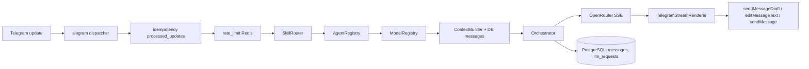

# Telegram AI Core

Production-oriented ядро Telegram-бота с поддержкой нескольких **агентов**, **навыков** (skills) и LLM-моделей через OpenRouter. Стек — `Python 3.12`, `FastAPI`, `aiogram 3`, `SQLAlchemy 2 (async)`, `PostgreSQL 16`, `Redis 7`, `httpx`, `Alembic`. Никаких LangChain / CrewAI / AutoGen.

## Что это

- aiogram-бот с long-polling (webhook заложен, но MVP проверяется на polling).
- FastAPI для health-check-ов и опционального webhook-роутера.
- Streaming-ответы через OpenRouter (SSE) и инкрементальная отрисовка в Telegram через `sendMessageDraft` + `editMessageText`.
- Маршрутизация запроса: команда → активный skill из conversation → keyword-matching → дефолт.
- Persistent storage: пользователи, чаты, conversation-ы, сообщения, журнал LLM-запросов, идемпотентность апдейтов.
- Rate limit и идемпотентность через Redis с graceful-degradation в случае его недоступности.

## Архитектура



Слои:

- `app/api/` — HTTP-роутеры FastAPI (`/health`, `/ready`, `/telegram/webhook`).
- `app/bot/` — aiogram-инфраструктура: bot factory, dispatcher, polling, handlers, renderers.
- `app/agents/`, `app/skills/`, `app/models/` — in-memory профили (registry).
- `app/core/` — `context_builder`, `orchestrator`, `rate_limit`, `idempotency`, `prompts`.
- `app/llm/` — клиент OpenRouter (httpx + ручной SSE).
- `app/db/` — SQLAlchemy ORM + репозитории.
- `app/redis/` — async Redis client.
- `app/utils/` — текстовые утилиты, в т.ч. сплиттер для Telegram (3900 символов).

## Локальный запуск

Требования: `docker`, `docker compose`.

```bash
cd telegram-ai-core
cp .env.example .env
# при желании заполни TELEGRAM_BOT_TOKEN и OPENROUTER_API_KEY
docker compose up -d --build
docker compose ps
curl http://localhost:8000/health
curl http://localhost:8000/ready
```

Без `TELEGRAM_BOT_TOKEN` бот не стартует, FastAPI работает.
Без `OPENROUTER_API_KEY` бот ответит «OpenRouter API key не настроен. Добавь OPENROUTER_API_KEY в переменные окружения.».

Тесты в контейнере:

```bash
docker compose exec -T app pytest -q
```

Локальная установка зависимостей вне Docker (опционально):

```bash
python3.12 -m venv .venv && source .venv/bin/activate
pip install -e ".[dev]"
pytest -q
```

## Деплой на Railway

1. Положи репозиторий на GitHub.
2. На Railway: **New Project → Deploy from GitHub repo → выбери этот репо**.
3. Добавь к проекту managed-сервисы **PostgreSQL** и **Redis** (плагины Railway).
4. В сервисе приложения открой **Variables** и добавь:
   - `APP_ENV=railway`
   - `TELEGRAM_MODE=polling`
   - `TELEGRAM_BOT_TOKEN=<твой токен>`
   - `OPENROUTER_API_KEY=<твой ключ>`
   - `OPENROUTER_MODEL=openai/gpt-4.1-mini`
   - `OPENROUTER_SITE_URL=https://your-domain.example`
   - `OPENROUTER_APP_NAME=Telegram AI Core`
   - `DATABASE_URL=${{Postgres.DATABASE_URL}}`
   - `REDIS_URL=${{Redis.REDIS_URL}}`
5. Railway автоматически подставит реальные URL баз через reference-переменные.
6. `railway.toml` уже содержит правильный `startCommand` (`bash scripts/entrypoint.railway.sh`) и `healthcheckPath=/health`. После первого деплоя миграции применятся автоматически.

После изменения переменных — нажми **Redeploy** в dashboard, либо `Restart` сервиса.

## Навыки, агенты, модели

### Skills

| id | команды | агент | модель |
|---|---|---|---|
| `chat` | `/chat` | `general` | `default_balanced` |
| `fast` | `/fast` | `general` | `default_fast` |
| `crypto` | `/crypto` | `crypto` | `crypto_model` |
| `finance` | `/finance` | `finance` | `finance_model` |
| `news` | `/news` | `news` | `news_model` |
| `devops` | `/devops`, `/infra` | `devops` | `devops_model` |

### Агенты

| id | имя | safety | дефолтная модель |
|---|---|---|---|
| `general` | Универсальный ассистент | standard | `default_balanced` |
| `crypto` | Криптовалютный аналитик | high | `crypto_model` |
| `finance` | Финансовый аналитик | high | `finance_model` |
| `news` | Новостной агент | standard | `news_model` |
| `devops` | DevOps инженер | standard | `devops_model` |

### Модели

| id | provider/model | tier | streaming |
|---|---|---|---|
| `default_fast` | openrouter / `google/gemini-2.0-flash-001` | cheap | да |
| `default_balanced` | openrouter / `openai/gpt-4.1-mini` | balanced | да |
| `crypto_model` | openrouter / `openai/gpt-4.1-mini` | balanced | да |
| `finance_model` | openrouter / `openai/gpt-4.1-mini` | balanced | да |
| `news_model` | openrouter / `google/gemini-2.0-flash-001` | cheap | да |
| `devops_model` | openrouter / `openai/gpt-4.1-mini` | balanced | да |

## Streaming в Telegram

- В private-чате: первый чанк — `sendMessageDraft` (с March 2026 это публичный метод Bot API для всех ботов), затем `editMessageText` с throttle 400–700 мс. Финальный текст — `sendMessage` или последний `editMessageText`.
- При `TelegramAPIError` на draft — fallback: обычный `sendMessage` + последующие `editMessageText`.
- В group/supergroup — сразу fallback, никаких draft-ов.
- `sendChatAction` не чаще раза в 4 секунды.
- Длинный финальный текст бьётся по 3900 символов через `app/utils/text_splitter.py`.
- Пустой ответ модели → пользователь получает «Не удалось получить ответ от модели.»

## Команды бота

- `/start`, `/help` — приветствие и справка.
- `/reset` — закрыть текущий conversation.
- `/status` — текущий agent / skill / model.
- `/history` — последние 20 сообщений диалога.
- `/agents`, `/agent <id>` — список и переключение агента.
- `/skills`, `/skill <id>` — список и переключение skill.
- `/models`, `/model <id>` — список и переключение модели (только если она в `allowed_model_ids` активного агента).
- Алиасы skill-ов: `/chat`, `/fast`, `/crypto`, `/finance`, `/news`, `/devops`, `/infra`.

## Ограничения окружения Railway

- На Free/Hobby бывают рестарты по таймауту бездействия — polling переподнимется автоматически.
- Используем reference-переменные `${{Postgres.DATABASE_URL}}` и `${{Redis.REDIS_URL}}` — без них entrypoint падает с понятной ошибкой.
- Healthcheck `/health` намеренно лёгкий и не проверяет БД, чтобы deploy-ы не залипали при холодных стартах.

## Ограничения MVP

- Tools для агентов архитектурно заложены (`AgentProfile.allowed_tools`), но не реализованы.
- Нет pgvector / RAG / долговременной memory; история ограничена `max_context_messages`.
- Нет managed bots в смысле Bot API 9.5 mini-app-flow — только обычный полноценный бот.
- Webhook-маршрут есть, но MVP-проверки идут через polling.
- Skills/Agents/Models — in-memory; миграция в БД — следующий этап.

## Что добавить следующим этапом

- Tools (HTTP, on-chain, RSS) и их вызов в потоке агента.
- pgvector + RAG поверх `messages` и внешних источников.
- Web-UI для управления registry (агенты/навыки/модели).
- Managed bots / mini-apps (Bot API 9.5+) и оплата через Telegram Stars.
- Интеграция с Sentry / OpenTelemetry / Prometheus.
